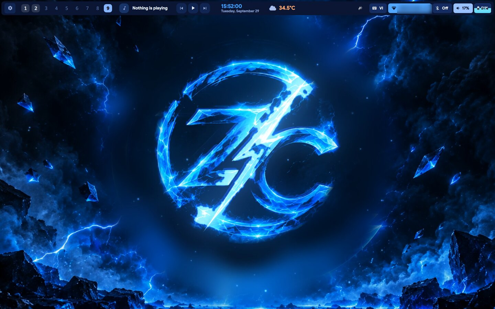
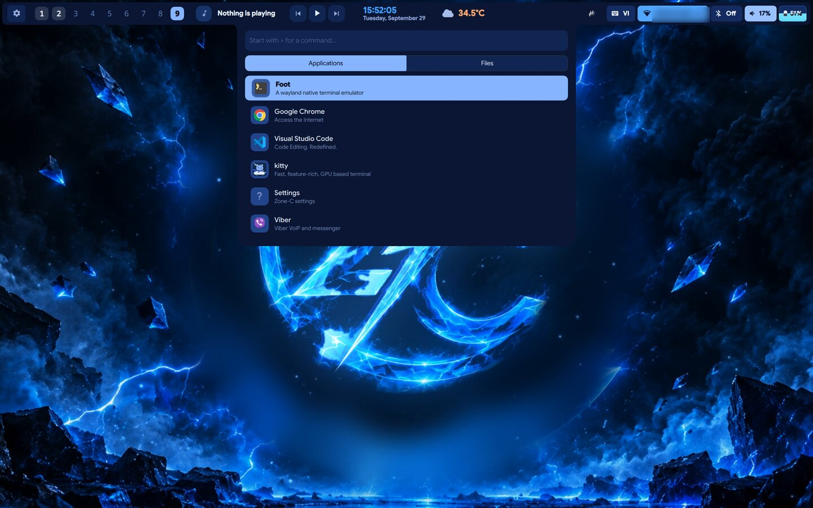
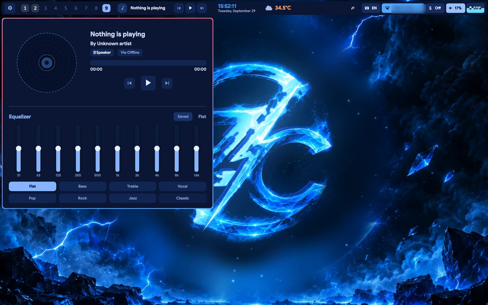
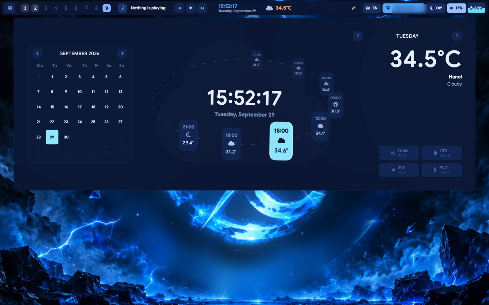
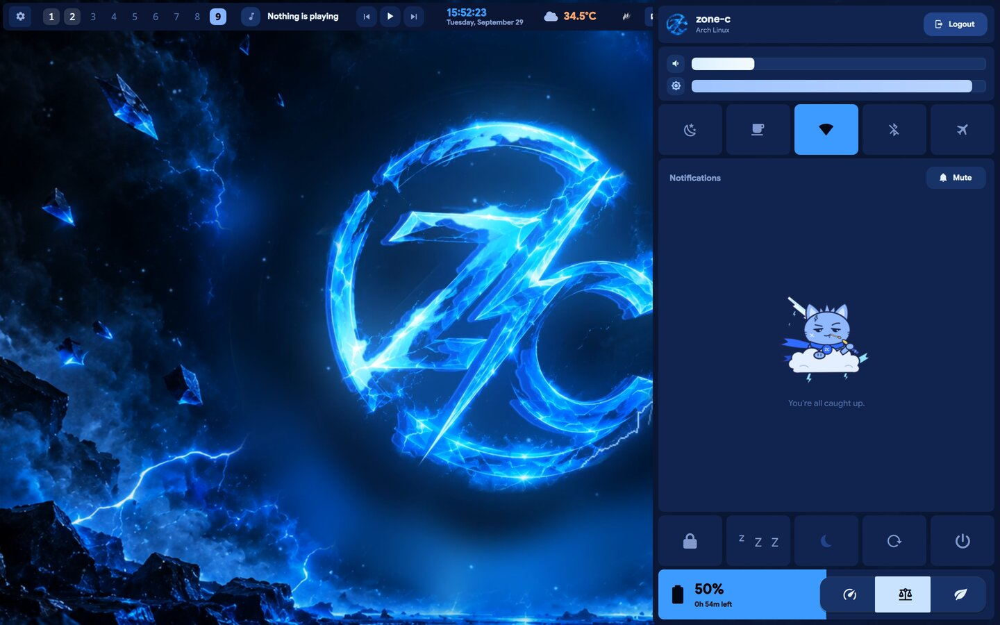
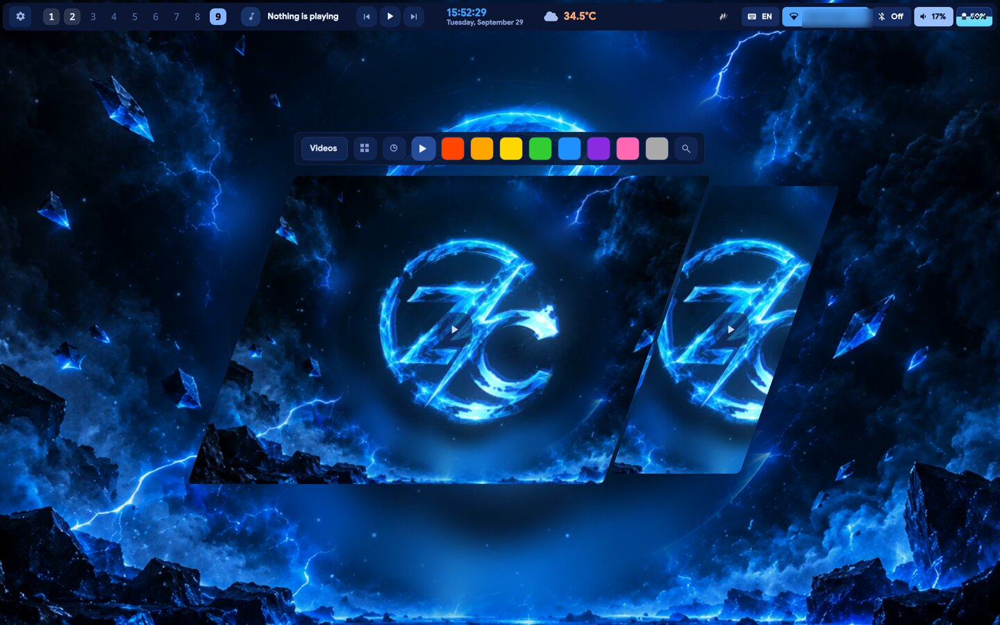

# Zone-C

Desktop shell cho Hyprland, viết bằng Quickshell, theo chủ đề **sấm sét xanh** — của **NgocVinh-Black**.

## Demo

[](docs/assets/demo.mp4)

▶ Bấm vào ảnh để xem video demo ([demo.mp4](docs/assets/demo.mp4)).

## Ảnh chụp

| | |
|---|---|
|  |  |
| **Launcher** | **Trình phát nhạc + equalizer** |
|  |  |
| **Lịch và thời tiết** | **Bảng hệ thống / thông báo** |
|  | |
| **Chọn hình nền** | |

## Giao diện

- **Hình nền video sấm sét** động, logo và mascot mèo sấm Zone-C.
- **Viền điện** chạy quanh cửa sổ đang dùng (shader nhiễu trên GPU) kèm ánh sáng xanh.
- **Bar** ở cạnh trên (đổi được sang trái / phải / dưới): workspace, nhạc, đồng hồ, thời tiết, mạng,
  Bluetooth, âm lượng, pin và nút chuyển gõ tiếng Việt (`VI` / `US`).
- **Trình phát nhạc** có cột cava nhảy theo nhạc và hiệu ứng tia sét quét theo nhịp.
- **Launcher** tìm ứng dụng, gõ `>` để chạy lệnh. Tự tắt Unikey khi mở để gõ tìm kiếm.
- **Theme** có sẵn: *Zone Thunder* và *Zone Crystal*, đổi trong phần cài đặt.
- **Màn hình khóa** và **SDDM** (theme `zone-thunder`) cùng phong cách, nền video.
- **Hộp xác nhận đóng** cửa sổ theo theme, **bảng phím tắt** theo theme.
- Thông báo, clipboard, lịch, chụp / quay màn hình, quick actions, polkit.
- **Terminal foot** nền xanh navy trong suốt, banner Zone-C + fastfetch khi mở, gợi ý lệnh cũ từ lịch sử
  (ble.sh — nhấn `→` để nhận).
- **Gõ tiếng Việt** bằng fcitx5 + Unikey, icon Papirus-Dark.

## Phím tắt chính

| Phím | Chức năng |
|---|---|
| `Super` | Mở launcher |
| `Super + /` | Xem bảng phím tắt |
| `Super + T` | Terminal |
| `Super + W` | Trình duyệt |
| `Super + Q` | Đóng panel / đóng cửa sổ (có hỏi xác nhận) |
| `Super + Shift + Q` | Đóng cửa sổ ngay |
| `Super + Shift + S` | Chụp vùng màn hình |
| `Super + Alt + R` | Quay màn hình |
| `Super + F` | Toàn màn hình |
| `Super + ←/→/↑/↓` | Chuyển cửa sổ |
| `Super + Page Up/Down` | Chuyển workspace |
| `Super + Shift + K` / phím Copilot | Bật / tắt con mèo float-cat |
| `Super + K` | Rồi kéo con mèo bằng chuột để dời chỗ |

## Con mèo float-cat (Claude Code)

Con mèo sấm nổi ở góc màn hình, hiện trên mọi workspace, không chặn chuột. Nó thở, chớp mắt, giật tai,
nhai que bông, vung kiếm; đám mây trôi và phóng sét. Màu tự đổi theo theme đang dùng.

Khi dùng [Claude Code](https://claude.com/claude-code), con mèo cho biết Claude đang làm gì:
khung suy nghĩ `• • •` khi đang chạy, dấu ✓ kèm nhảy lên khi xong, "Cần bạn nè!" khi chờ bạn duyệt.

Script cài đặt chép con mèo vào `~/.local/share/float-cat` và lệnh `float-cat` vào `~/.local/bin`.
Để con mèo đi theo Claude Code, thêm các hook sau vào `~/.claude/settings.json` (gộp với `hooks` đang có):

```json
{
  "hooks": {
    "SessionStart":     [{ "hooks": [{ "type": "command", "command": "~/.local/bin/float-cat start" }] }],
    "SessionEnd":       [{ "hooks": [{ "type": "command", "command": "~/.local/bin/float-cat stop" }] }],
    "UserPromptSubmit": [{ "hooks": [{ "type": "command", "command": "~/.local/bin/float-cat say thinking" }] }],
    "PostToolUse":      [{ "hooks": [{ "type": "command", "command": "~/.local/bin/float-cat say thinking" }] }],
    "Notification":     [{ "hooks": [{ "type": "command", "command": "~/.local/bin/float-cat say ask" }] }],
    "Stop":             [{ "hooks": [{ "type": "command", "command": "~/.local/bin/float-cat say done" }] }]
  }
}
```

Không dùng Claude Code thì vẫn bật / tắt tay được: `float-cat toggle` hoặc `Super + Shift + K`.
Xoá `~/.local/state/float-cat/pos.json` để đưa con mèo về góc phải dưới.

## Cài đặt (Arch Linux và các bản dựa trên Arch)

```bash
bash -c "$(curl -fsSL https://raw.githubusercontent.com/NgocVinh-Black/Zone-C/main/install/install.sh)"
```

Hoặc clone về rồi chạy:

```bash
git clone https://github.com/NgocVinh-Black/Zone-C.git
cd Zone-C
./install/install.sh
```

Để cập nhật, chạy lại script và chọn "update".

Cấu hình mẫu cho các compositor khác (niri, sway) nằm trong thư mục [compositors](compositors).

## Giấy phép

Zone-C là tác phẩm phái sinh của [Serpantinum](https://github.com/ilyamiro/serpantinum) © ilyamiro,
phân phối theo [GNU AGPL-3.0](LICENSE.md).
Mọi bản phân phối lại hoặc chỉnh sửa tiếp theo cũng phải giữ giấy phép AGPL-3.0 và ghi công các tác giả.
